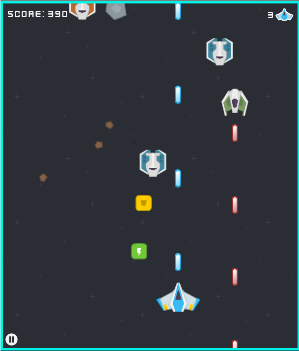

## DESCRIPTION

github---> https://github.com/MichalGoly/SpaceShooter

Space shooter is an HTML5 canvas game with conservation of momentum developed by me
using JavaScript as part of a programming assignment at Aberystwyth University.
It is currently hosted here: [http://users.aber.ac.uk/mwg2/ftw/](http://users.aber.ac.uk/mwg2/ftw/)

## GAME MECHANICS

Keyboard arrows can be used to control the spacecraft. Laser bullets are fired automatically, and player
is not able to control them manually. There are two ways to score points in the game.
Player can either shoot up the meteors for 10 points each, or the enemy spacecrafts worth
20 points each. All the enemies and obstacles are being spawned outside of the canvas on
the top of the screen, and start their descent towards the bottom in a random manner.

Meteors can be of three different sizes which has an effect on their mass. They also
have a random vertical/horizontal velocities and a rotation assigned to them when they are
spawned. There are 4 types of enemies with different, predefined artificial intelligence. The
blue enemies descent to a random vertical position and then try to crash into the player.
The red spacecrafts behave like the blue ones but they are much quicker. The green ones
fly from the top to the bottom of the screen without ever changing direction while shooting
red laser bullets. Finally, the black enemies are the most dangerous as not only are they
as quick as the red ones, but they also perform a random flight across the screen with the
final task of crashing into the player, while shooting constantly at the same time.

The conservation of momentum has been incorporated into the game by allowing the
meteors to bump into each other. Player's spacecraft can also collide with the enemies
or the meteors themselves. All the entities in the game, apart from the laser bullets and
power ups, have both the mass and velocities. This way after a collision is being detected,
it can be resolved in a perfectly elastic manner. Finally, there are two power ups available
for the player to pick up. A shield which will protect him from the enemies for a duration
of 15 seconds, and a green bolt capable of decreasing the delay between the player's bullets
being shot. Game becomes more and more difficult as the time progress due to the amount
of meteros and enemies being spawned every second.

## KNOWN ISSUES
It is not possible to play the game using the Internet Explorer web browser due to its
lack of support for the `currentTime` DOM property. There is also no support for the
touch events and canvas does not scale properly on smaller screens, therefore it is
not really possible to play the game using mobile devices.

## CREDITS

- All the sprites and sounds, apart from the explosion ones by [Kenney Vleugels](http://www.kenney.nl)
  under the [CC0 1.0 License](https://creativecommons.org/publicdomain/zero/1.0/)
- Explosion spritesheet (chopped by me to separate PNG files) by [Ville Seppanen](http://villeseppanen.com)
  under the [CC BY 3.0 License](https://creativecommons.org/licenses/by/3.0/)
- Explosion sound (no changes made) by [Michel Baradari](http://apollo-music.de)
  under the [CC BY 3.0 License](https://creativecommons.org/licenses/by/3.0/)
- Pause and Play icons (no changes made) by [Gregor Cresnar from the Noun Project](https://thenounproject.com/search/?q=pause&i=200252)
  under the [CC BY 3.0 License](https://creativecommons.org/licenses/by/3.0/)

## 3RD PARTY LIBRARIES USED
- [jQuery 2.2.2](https://jquery.com/)
